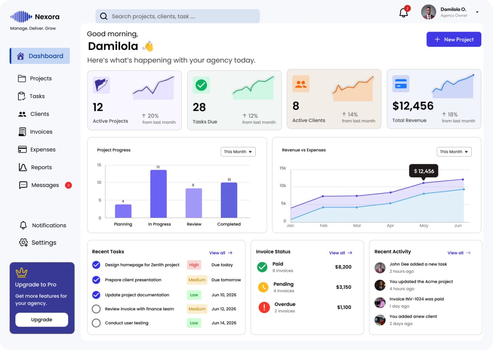
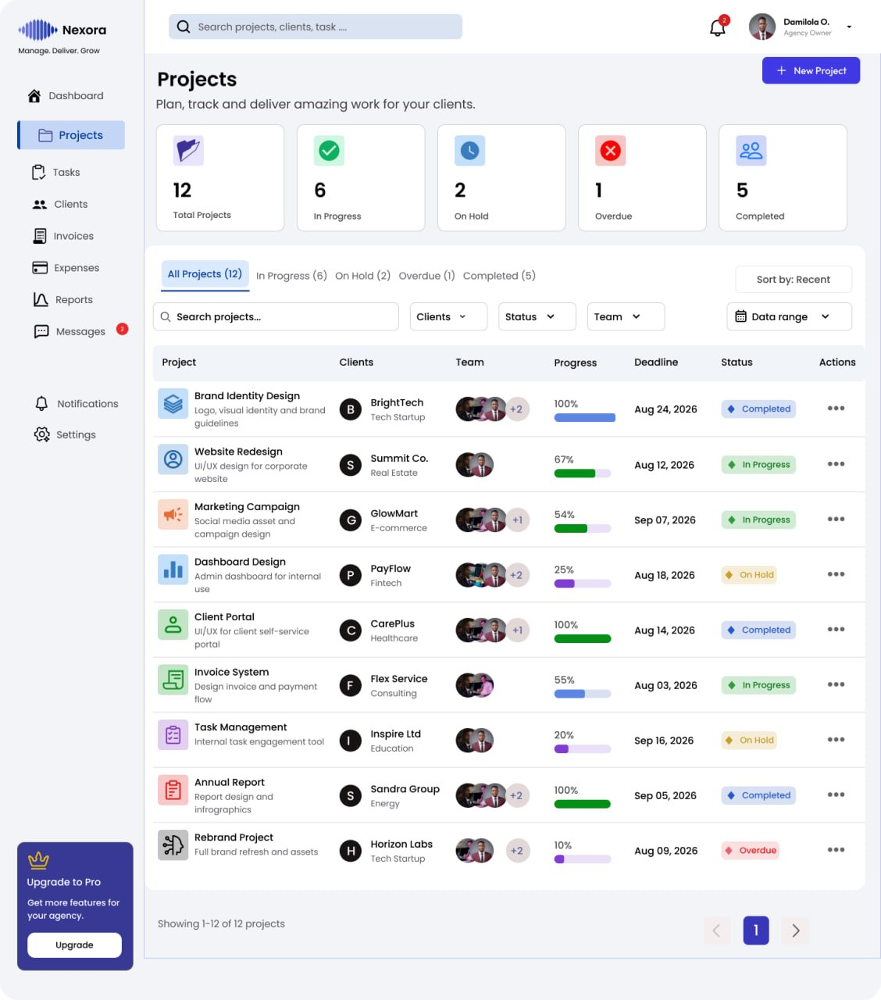
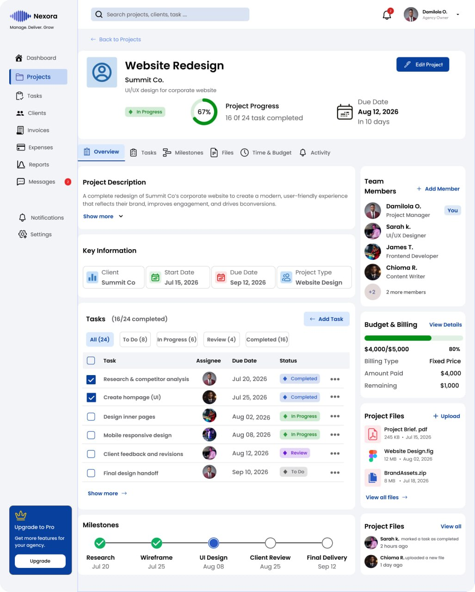

# UI Design — Nexora

## Overview

Nexora is an agency management SaaS platform designed to help creative agencies manage projects, tasks, clients, invoices, expenses and business performance from one centralized workspace.

## Dashboard

The dashboard provides agency owners with an at-a-glance overview of their business, helping them quickly understand what requires attention.

### Key Dashboard Features

- Active projects overview
- Tasks requiring attention
- Active client tracking
- Revenue monitoring
- Project progress analytics
- Revenue vs expenses
- Recent tasks
- Invoice status
- Recent activity

## Design Decisions

### Visual Hierarchy
Important business metrics are positioned at the top of the dashboard so users can understand performance quickly.

### Color System
A blue and purple primary palette establishes the Nexora brand, while green, orange and red communicate different statuses and priorities.

### Card-Based Layout
Information is grouped into cards to make complex agency data easier to scan and understand.

### Navigation
Persistent sidebar navigation provides quick access to Projects, Tasks, Clients, Invoices, Expenses, Reports, Messages and Settings.

## Tools

- Figma
- FigJam
- GitHub

## Final Dashboard UI

## Projects Page

The Projects page provides a centralized view of agency projects, allowing users to quickly monitor project status, progress, deadlines, assigned teams, and clients.

### Key Features

- Project status overview
- Search and filtering
- Client and team filtering
- Project progress tracking
- Deadline visibility
- Completed, in-progress, on-hold and overdue states
- Quick project actions

### Final Projects UI

## Project Details Page

The Project Details page gives agency teams a complete view of an individual project, bringing together project progress, tasks, milestones, team members, files, deadlines, and billing information in one workspace.

### Key Features

- Project progress tracking
- Project status and deadline visibility
- Team member management
- Task management and task statuses
- Project milestones
- Budget and billing summary
- Project files and uploads
- Recent project activity
- Quick project editing

### Final Project Details UI

